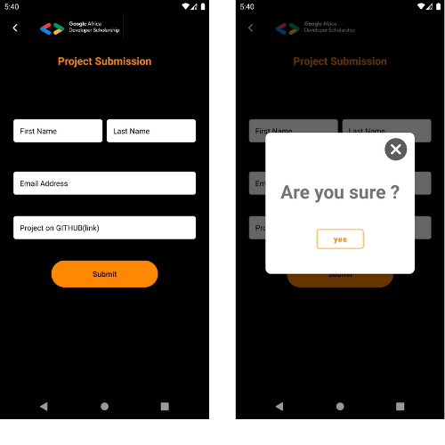
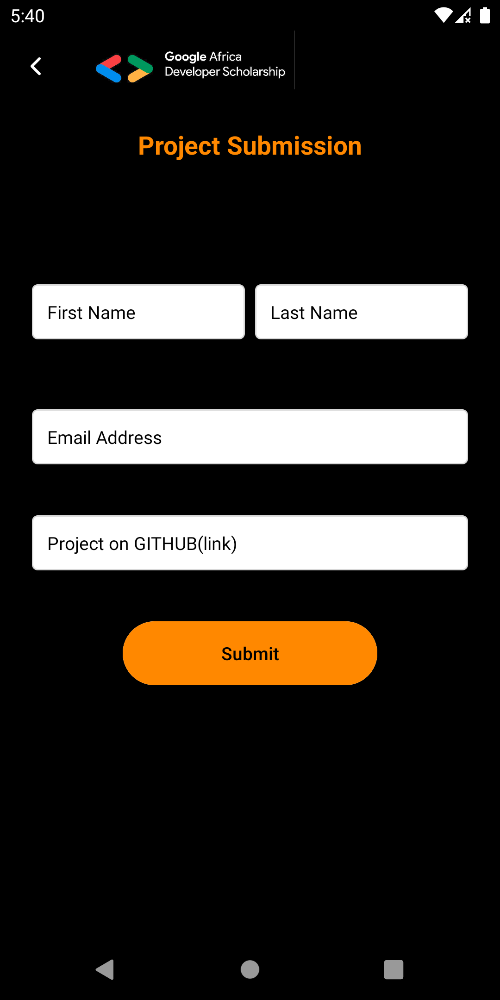

# GADSPhaseTwoProject
Google Africa Developer Scholarship Phase II. Associate Android Developer Practice Project

This project was refactored to use some of the best practices in android development
Using:
 * Room
 * Kotlin Coroutines 
 * Retrofit
 * Dependency Injection with [Hilt](https://dagger.dev/hilt/)
 * LiveData
 * ViewModel
 

 ## Resources to take a look at
 * [Guide to app architecture](https://developer.android.com/jetpack/guide)
 * [RickAndMorty-AndroidArchitectureSample](https://github.com/sberoch/RickAndMorty-AndroidArchitectureSample)
 * [Eli-Fox LEGO Catalog project](https://proandroiddev.com/android-architecture-starring-kotlin-coroutines-jetpack-mvvm-room-paging-retrofit-and-dagger-7749b2bae5f7)
